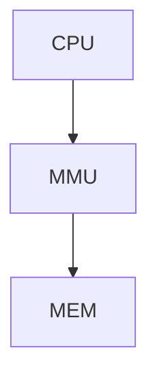

# LEC4 Page Tables(VM)

**Plan:**

- Address spaces
- Paging hardware(RISC-V)
- xv6 vm code + layout

## Isolation ===> Memory Isolation

## **Address Spaces**

Each process has its own address space(**Completely Independent**)

## Page Tables(Hardware)

**Every app has its own map (VA===>PA)**

**There isn't actually the map in the MMU, it's just for translation.**

**satp register**:

- records the map which should be used ====> $2^{64}$

- store the physical address

4KB per page

Virtual Memory Space:

- $2^{39}\approx512$Gbyte

- 27bits for index, 12 bits for offset ===> $2^{12} = 4096$

Physical Memory Space:

- 56 bits wide ===> 44 bits ppn, 12 bits for offset

- Physical Memory Space is larger than Virtual Memory Space

  

## Translation Lock-aside Buffer ===> TLB

Cache of pte entries **stores [VA, PA]**

Switch page table ===> flush TLB

===> Page tables provide level of redirection

- Kernelbase 0x80000000
- Physical Address Space:
  - DRAM
  - I/O device