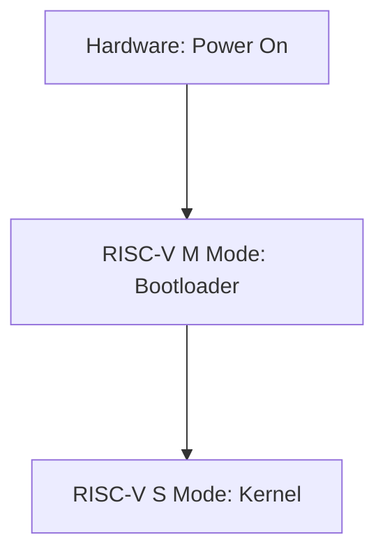

# Lab2 System Calls

在本实验中，需要向xv6中增加一些新的系统调用

## **Lab2前置要求**

- 阅读xv6 book的第2章、第4章4.3以及4.4
- 系统调用的用户空间代码在`user/user.h`和`user/usys.pl`中
- 内核空间代码是`kernel/syscall.h`， `kernel/syscall.c`
- 与进程相关的代码是`kernel/proc.h`和`kernel/proc.c`

## **Note**

### Chapter2 

- The operating system must *time-share* the resources of the computer among these processes.
- Thus an operating system must fulfill three requirements: **multiplexing**, **isolation**, and **interaction**.

- Focus on a monolithic kernel(also there is microkernel)
- Xv6 runs on a multi-core RISC-V microprocessor(written in "LP64" C)

#### 2.1 Abstracting physcial resources

- To achieve strong isolation it’s helpful to forbid applications from directly accessing sensitive hardware resources, and instead to abstract the resources into services

#### 2.2 User mode, supervisor mode, and system calls

- Strong isolation requires**a hard boundary between applications and the OS**

- mode

  - machine mode

    - have full privilege

    - a CPU starts in machine mode

    - intended for configuring a computer
    - Xv6 executes a few lines in machine mode and then changes to supervisor mode

  - supervisor mode

    - the CPU is allowed to execute privileged instructions
    - e.g. interrupts, reading and writing the register that holds the addr. of a page table
    - user space & kernel space
    - **entry point** for transitions to supervisor mode is controlled by the kernel

#### 2.3 Kernel Organization

===> What part of the OS should run in supervisor mode?

All implementations of all system calls run in supervisor mode. This organization is called **a monolithic kernel**

- The entire OS run with full hardware privilege
- Disadvantage of the monolithic kernel: the interfaces between different parts of the OS are often complex

===> To reduce the risk of mistakes in the kernel, minimize the amount of OS code that runs in supervisor mode, and execute the bulk of the OS in user mode. This kernel organizationi is called **microkernel**

- the kernel interface consists of a few low-level functions for starting applications, sending messages, accessing device hardware, etc (make the kernel relatively simple)

#### 2.4 Code: xv6 organization

Skip

#### 2.5 Process Overview

The unit of isolation in xv6 (as in other Unix operating systems) is a **process**. 

- Xv6 uses page tables (which are implemented by hardware) to give each process its own ad- dress space
  - page table is process-independent

- The xv6 kernel maintains many pieces of state for each process, which it gathers into a struct proc (`kernel/proc.h`:86)

- A process’s most important pieces of kernel state are its **page table**, its **kernel stack**, and its **run state**.
- in RISC-V, ecall(switch to kernel space)/sret(return to user space) 

#### 2.6 Code: starting xv6, the first process and system call

**More Specific**:

- The boot loader loads the xv6 kernel into memory at physical addr. 0x80000000. (0x0:0x8000000 contains I/O devices)
- The stack on RISC-V grows down(the code at _entry loads the sp = stack0+4096).
- The function *start* performs some configuration that is only allowed in M mode, and then switches to S mode(RISC-V `mret`).
- `start` sets things up as if there had been one ===> 
  - set the previous privilege mode to supervisor in `mstatus`
  - set the return addr. to main by writing main's addr. into `mepc`
  - disable virtual addr. translation in S mode by writing 0 into the (page-table register) `satp`; delegates all interrupts and exceptions to S mode
- After main initializes several devices and subsystems, **the first process by calling `userinit`** is created

- Then make the first system call in xv6. initcode.S loads the number of the exec system call
- The kernel uses the number in register a7 in syscall to call the desired system call.
- Once the kernel has completed `exec`, it returns to user space in the /init process.

#### 2.7 Security Model

### Chapter4

#### 4.3 Code: Calling system calls

#### 4.4 Code: System call arguments 